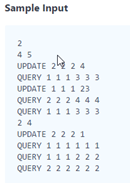
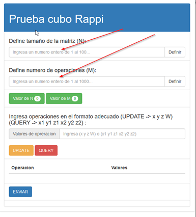
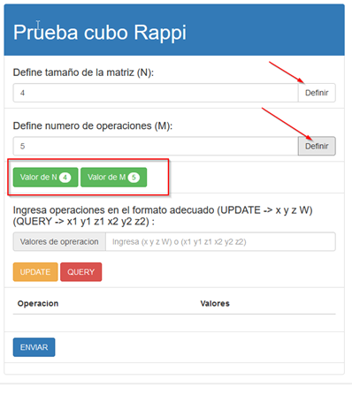
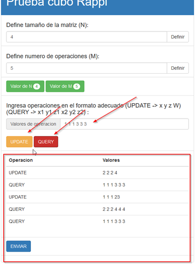
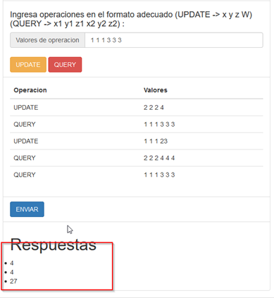
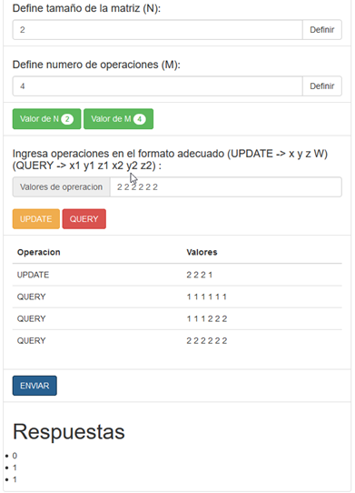
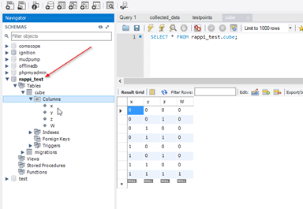

<div class=WordSection1>

<p class=MsoNormal><span class=fontstyle01><span lang=ES>Prueba técnica Rappi –
Andrés Quiroga</span></span></p>

<p class=MsoNormal><span class=fontstyle01><span lang=ES>La aplicación se creó
con en PHP 7.0.2  y Laravel 5.4; se utilizó bootstrap y jQuery en la vista y la
base de datos utilizada fue MySql.</span></span></p>

<p class=MsoNormal><span class=fontstyle01><span lang=ES>La aplicación tiene
las 3 capas del modelo vista controlador  </span></span></p>

<p class=MsoNormal style='text-align:justify'><span class=fontstyle01><span
lang=ES>La única vista existente esta creada en la carpeta “resources/view” el
archivo se llama cube.blade.php y es una vista de laravel con el motor de
platillas blade, para el soporte de las operaciones de la vista se creó el
archivo “public/js/rappi_test.js” la cual contiene todas las operaciones en
javascript – jQuery y los request Ajax</span></span></p>

<p class=MsoNormal style='text-align:justify'><span class=fontstyle01><span
lang=ES>El controlador se encuentra en la carpeta
“app/Http/Controllers/CubeController.php” aca se reciben las operaciones de la
vista, para la prueba se creó el get de la página y la respuesta a la petición
Ajax de los resultados. Otra parte de la lógica de negocio se encuentra en la
clase Query.php  en la carpeta “app/Util” cuya responsabilidad es hacer las
consultas en base de datos y realizar los cálculos.</span></span></p>

<p class=MsoNormal><span class=fontstyle01><span lang=ES>El modelo es una sola
tabla representada con la clase Cube.php</span></span></p>

<p class=MsoNormal><span class=fontstyle01><span lang=ES>Se crearon las
migraciones para laravel con el objetivo de crear la única tabla que se utiliza
en la prueba.</span></span></p>

<p class=MsoNormal><span class=fontstyle01><span lang=ES>Para ejecutar el proyecto
se debe configurar el .env con los datos de la conexión y ejecutar las
migraciones con el comando </span></span></p>

<p class=MsoNormal><span class=fontstyle01><span lang=ES>php artisan migrate </span></span></p>

<p class=MsoNormal><span class=fontstyle01><span lang=ES>El proyecto se debe
dejar con la siguente url en el equipo local para que no fallen las peticiones
Ajax</span></span></p>

<p class=MsoNormal><span lang=ES><a
href="http://127.0.0.1/rappi_test/public/cube"><span class=fontstyle01><span
style='text-decoration:none'>http://127.0.0.1/rappi_test/public/cube</span></span></a></span></p>

<p class=MsoNormal><span class=fontstyle01><span lang=ES>Lo códigos se encuentran
publicados en gitHub en la url </span></span><span lang=ES><a
href="https://github.com/rquiroga83/rappi_test"><span class=fontstyle01><span
style='text-decoration:none'>https://github.com/rquiroga83/rappi_test</span></span></a></span></p>

<p class=MsoNormal><span class=fontstyle01><span lang=ES>&nbsp;</span></span></p>

<p class=MsoNormal><span class=fontstyle01><b><span lang=ES>Ejemplo de
funcionamiento comparado con el test de la página hackerrank:</span></b></span></p>

<p class=MsoNormal><span class=fontstyle01><span lang=ES>Test de la página
hackerrank</span></span></p>

<p class=MsoNormal><span style='font-size:10.5pt;line-height:115%;background:
#FAFAFA'></span></p>

<p class=MsoNormal align=center style='text-align:center'></p>

<p class=MsoNormal align=center style='text-align:center'><u><span lang=ES><span
 style='text-decoration:none'>&nbsp;</span></span></u></p>

<p class=MsoNormal align=center style='text-align:center'><u></u></p>

<p class=MsoNormal align=center style='text-align:center'><u></u></p>

<p class=MsoNormal align=center style='text-align:center'><u></u></p>

<p class=MsoNormal align=center style='text-align:center'><u><span lang=ES><span
 style='text-decoration:none'>&nbsp;</span></span></u></p>

<p class=MsoNormal><b><span lang=ES>Segunda prueba</span></b></p>

<p class=MsoNormal><b><span lang=ES>&nbsp;</span></b></p>

<p class=MsoNormal align=center style='text-align:center'></p>

<p class=MsoNormal><span lang=ES>Esta última prueba quedo en base de datos como
sigue;  los valores de la matriz están desde cero es decir que las posiciones
x, y , z son almacenadas como x-1, y-1 y z-1:</span></p>

<p class=MsoNormal><span lang=ES>&nbsp;</span></p>

<p class=MsoNormal align=center style='text-align:center'></p>

<p class=MsoNormal><span lang=ES>&nbsp;</span></p>

<p class=MsoNormal><span lang=ES>&nbsp;</span></p>

<p class=MsoNormal><span class=fontstyle01><b><span lang=ES>Respuesta a
preguntas</span></b></span></p>

<p class=MsoNormal><span lang=ES style='font-family:"Corbel","sans-serif";
color:black'><br>
<span class=fontstyle01>1. ¿En qué consiste el principio de responsabilidad
única? ¿Cuál es su propósito?</span></span></p>

<p class=MsoNormal style='text-align:justify'><span class=fontstyle01><span
lang=ES>El principio de responsabilidad única consiste es que cada clase debe
tener solamente una única responsabilidad en una funcionalidad de tal manera
que si la funcionalidad falla sea solo esa clase la que se deba modificar.</span></span></p>

<p class=MsoNormal style='text-align:justify'><span class=fontstyle01><span
lang=ES>Un ejemplo podría ser cuando tenemos una funcionalidad que coloca
mensajes automáticamente en twitter desde diferentes fuentes, el principio de
responsabilidad única indicaría que la lógica que twittea debe delegarse a una
sola clase en toda la aplicación y no repetir la misma funcionalidad en las
clases que generan los mensajes.</span></span></p>

<p class=MsoNormal><span lang=ES style='font-family:"Corbel","sans-serif";
color:black'><br>
<span class=fontstyle01>2. ¿Qué características tiene según tu opinión “buen”
código o código limpio?</span></span></p>

<p class=MsoNormal style='text-align:justify'><span class=fontstyle01><span
lang=ES>A mi parecer las principales característica de un código limpio son la documentación,
el evitar la escritura de métodos extensos, evitar la escritura de métodos no
necesarios y tratar al máximo de reutilizar las funcionalidades para que los
fallos sean fácilmente localizables.</span></span></p>

<p class=MsoNormal style='text-align:justify'><span class=fontstyle01><span
lang=ES>&nbsp;</span></span></p>

<p class=MsoNormal style='text-align:justify'><span class=fontstyle01><b><span
lang=ES>Problemas con el código</span></b></span></p>

<p class=MsoNormal style='text-align:justify'><span class=fontstyle01><span
lang=ES>En el código se encuentran los siguientes problemas.</span></span></p>

<p class=MsoNormal style='text-align:justify'><span class=fontstyle01><span
lang=ES>La entidad $servicio es cargada múltiples veces desde base de datos solo
es necesario cargarla una vez.</span></span></p>

<p class=MsoNormal style='text-align:justify'><span class=fontstyle01><span
lang=ES>Una situación similar a la anterior sucede con la variable “driver_id”
la cual se trae multiples veces de request solo es necesario traerla una vez y
luego utilizarla en donde se requiera.</span></span></p>

<p class=MsoNormal style='text-align:justify'><span class=fontstyle01><span
lang=ES>La línea “return Response::json(array('error'=&gt;'0'));” esta repetida
lo que dificulta el seguimiento del error.</span></span></p>

<p class=MsoNormal style='text-align:justify'><span class=fontstyle01><span
lang=ES>La entidad Service se actualiza múltiples veces esto se puede colocar
en una sola operación.</span></span></p>

<p class=MsoNormal style='text-align:justify'><span class=fontstyle01><span
lang=ES>La variable servicio es sobrescrita por un update esto genera confusión
en el seguimiento del código.</span></span></p>

<p class=MsoNormal style='text-align:justify'><span class=fontstyle01><span
lang=ES>La variable “$return” nunca es utilizada</span></span></p>

<p class=MsoNormal style='text-align:justify'><span class=fontstyle01><b><span
lang=ES>Para solucionar los problemas se implementaron las siguientes correcciones:</span></b></span></p>

<p class=MsoNormal style='text-align:justify'><span class=fontstyle01><span
lang=ES>Se realizó la carga de la entidad Servicio en un solo lugar</span></span></p>

<p class=MsoNormal style='text-align:justify'><span class=fontstyle01><span
lang=ES>Se eliminó la sobreescritura de la variable “$servicio” por el update.</span></span></p>

<p class=MsoNormal style='text-align:justify'><span class=fontstyle01><span
lang=ES>Se colocó la lectura de la variable “driver_id” en un solo lugar</span></span></p>

<p class=MsoNormal style='text-align:justify'><span class=fontstyle01><span
lang=ES>Se refactorizo el condicional para que solo fuera necesario colocar la línea
“return Response::json(array('error'=&gt;'0'));” en un lugar.</span></span></p>

<p class=MsoNormal style='text-align:justify'><span class=fontstyle01><span
lang=ES>Se colocó la actualización de la entidad Service en un solo lugar.</span></span></p>

<p class=MsoNormal style='text-align:justify'><span class=fontstyle01><span
lang=ES>Se eliminó la variable “$return”</span></span></p>

<p class=MsoNormal style='text-align:justify'><span class=fontstyle01><span
lang=ES>&nbsp;</span></span></p>

<p class=MsoNormal style='text-align:justify'><span class=fontstyle01><span
lang=ES>&nbsp;</span></span></p>

<p class=MsoNormal style='text-align:justify'><span class=fontstyle01><span
lang=ES>&nbsp;</span></span></p>

<p class=MsoNormal style='text-align:justify'><span class=fontstyle01><span
lang=ES>&nbsp;</span></span></p>

<p class=MsoNormal style='text-align:justify'><span lang=ES style='font-family:
"Corbel","sans-serif";color:black'>&nbsp;</span></p>

</div>

public function post_confirm(){
    $id = Input::get('service_id');
    $servicio = Service::find($id);
    //dd($Servicio);
    if ($servicio != NULL){
        if  ($servicio->status_id == '6'){
            return Response::json(array('error' => '2'));
        }
        if ($servicio->driver_id == NULL && $servicio->status_id == '1'){

            $driver_id = Input::get('driver_id');

            Driver::update($driver_id, array(
                'available' => '0'
            ));
            $driverTmp = Driver::find($driver_id);
            Service::update($id, array(
                'driver_id' => $driver_id,
                'status_id' => '2',
                'car_id'=>$driverTmp->car_id
                //Up Carro
                //,'pwd' => md5(Input::get('pwd'))
            ));
            //Notificar a usuario!!
            $pushMessage = 'Tu servicio ha sido confirmado!';

            $push = Push::make();
            if ($servicio->user->uuid != ''){
                if($servicio->user->type == '1'){//iPhone
                    $result = $push->ios($servicio->user->uuid, $pushMessage, 1, 'honk.wav','Open', array('service_id'=>$servicio->id));
                } else{
                    $result = $push->android2($servicio->user->uuid, $pushMessage, 1, 'default','Open', array('service_id'=>$servicio->id));
                }
            }
            return Response::json(array('error'=>'0'));
        }else{
            return Response::json(array('error'=>'1'));
        }
    }else{
        return Response::json(array('error'=>'3'));
    }
}

```php

```
