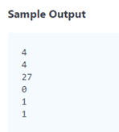

### Desarrollo de codigo

La aplicación se creó con en PHP 7.0.2 y Laravel 5.4; se utilizó bootstrap y jQuery en la vista, y la
base de datos utilizada fue MySql, aunque la prueba pudo realizarse sin el uso de base de datos
se creó una tabla para el almacenamiento de la matriz.

La aplicación tiene las 3 capas del modelo vista controlador.

La única vista existente esta creada en la carpeta “resources/view” el
archivo se llama cube.blade.php y es una vista de laravel con el motor de
platillas blade, para el soporte de las operaciones de la vista se creó el
archivo “public/js/rappi_test.js” la cual contiene todas las operaciones en
javascript – jQuery y los request Ajax.

El controlador se encuentra en la carpeta “app/Http/Controllers/CubeController.php” aca se reciben las operaciones de la
vista, para la prueba se creó el get de la página y la respuesta a la petición
Ajax de los resultados. Otra parte de la lógica de negocio se encuentra en la
clase Query.php ubicada en la carpeta “app/Util” cuya responsabilidad es hacer las
consultas en base de datos y realizar los cálculos.

El modelo es una sola tabla representada con la clase "Cube.php"

Se crearon las migraciones para laravel con el objetivo de crear la única tabla que se utiliza
en la prueba.

Para ejecutar el proyecto
se debe configurar el .env con los datos de la conexión y ejecutar las
migraciones con el comando 

php artisan migrate 

El proyecto se debe
dejar con la siguente url en el equipo local para que no fallen las peticiones
Ajax

<a
href="http://127.0.0.1/rappi_test/public/cube">http://127.0.0.1/rappi_test/public/cube</a>

Lo códigos se encuentran
publicados en gitHub en la url <a
href="https://github.com/rquiroga83/rappi_test">https://github.com/rquiroga83/rappi_test</a>

&nbsp;

### Ejemplo de funcionamiento comparado con el test de la página hackerrank:

Test de la página
hackerrank

<u>&nbsp;</u>

<u></u>

<u></u>

<u></u>

<u>&nbsp;</u>

<b>Segunda prueba</b>

<b>&nbsp;</b>

Esta última prueba quedo en base de datos como
sigue;  los valores de la matriz están desde cero es decir que las posiciones
x, y , z son almacenadas como x-1, y-1 y z-1:

&nbsp;

